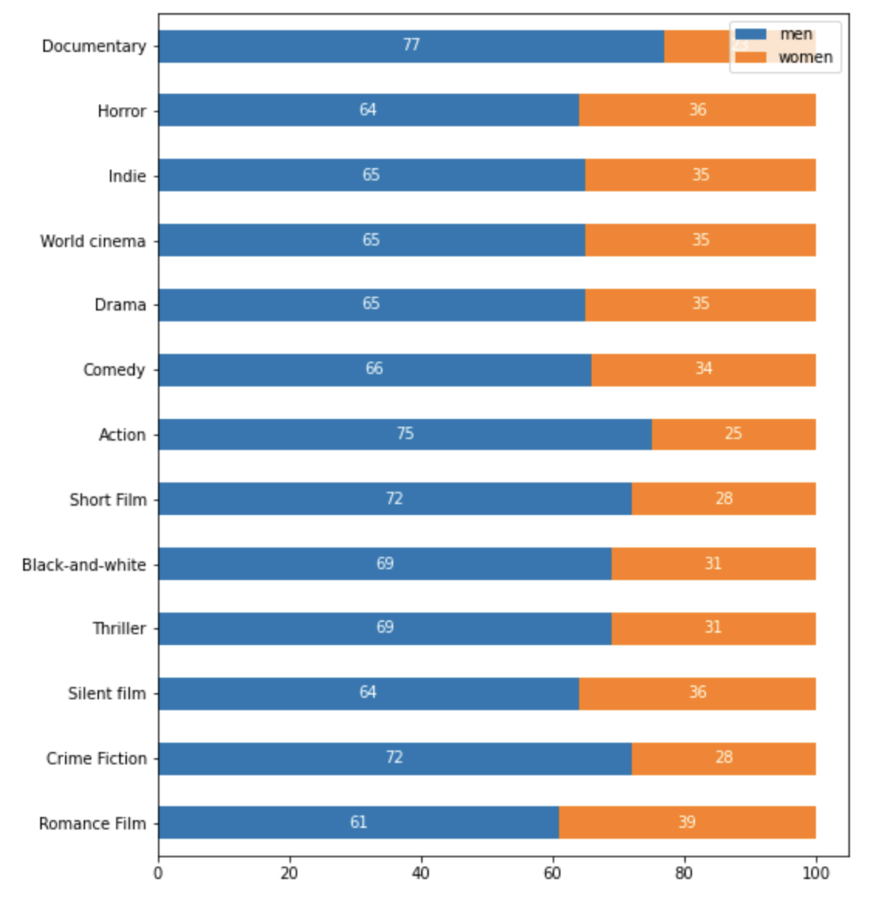
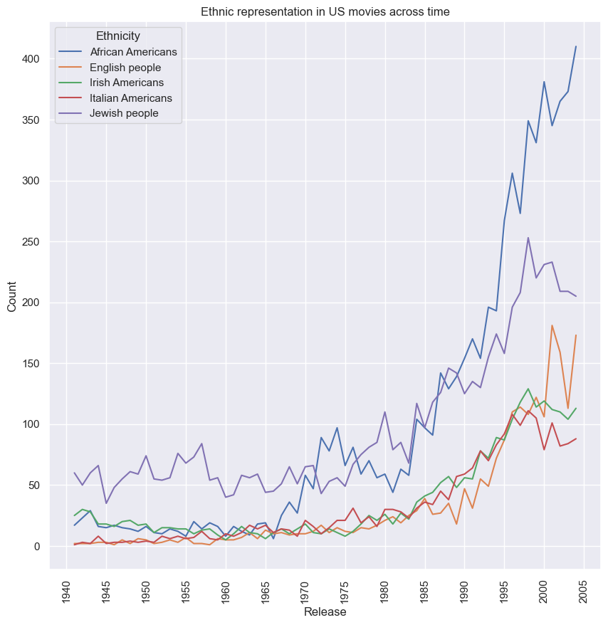

# Sex and ethnic representation in movies
Rlab - P2 Milestone

## Abstract

The movie industry has received much criticism in the last few years due to poor representation, which impacts [children's development](https://academic.oup.com/jcr/article/32/1/119/1796308?login=true). If children cannot find themselves in movie characters' it may impact their future self-esteem. Moreover, gender stereotypes have an impact on children's personality development. It is meaningful to acknowledge the lack of representation in the movie industry in order to improve it.
This specific study analyzes sex and ethnic representation in the movie industry. Additionally, an exploration of the representation evolution across time is present to determine if the movie industry is trying to better reflect our society, which would positively impact children's development.  

## Research questions

In what extent is the film industry displaying an accurate representation of today’s society?
Answering such large question can be done by dividing it in a subset of questions:

A) Are the different ethnicities and sex as represented as they are in real life? 

B) If there is a difference in representation, where does it occur most? In which geographical area? In which movie genre?

C) How is the representation evolving with the increase of box office?

## Proposed additional dataset

* **AD1: [Population by national and/or ethnic group, sex and urban/rural residence](http://data.un.org/Data.aspx?d=POP&f=tableCode:26)** : 
This dataset will provide us with base informations about ethnicities and sex representation in each country. We will only scrap the following attributes: "Country or Area", "Sex", "National and/or ethnic group", "Value".

## Methods

**Step 1: Pre-processing data:**
Since only a part of the additional dataset will be relevant for the study, the unused attributes will be cleaned from the dataset. The countries not included in the CMU Movie Summary Corpus will not be used for this study, and the corresponding rows will therefore be deleted.

**Step 2: General Analysis:**
To get an idea of global trends existing, preliminary analysis on the CMU Movie Summary Corpus will be conducted:

	Sex Representation across movie genres

  

_General analysis of sex representation across the most present movie genres. We can observe an important difference between men and women role distribution. To continue our analysis we will look at the evolution of sex representation across time._

	Ethnic count across time in US

  

_General count of different ethnicities in the US in particular. Some ethnicities are more present than others. However, we have seen a big limitation during this analysis: some ethnicities are very particular, such as irish americans, italian americans, african americans but others are very vague (Indians). We will be working on this limitations in further analysis._

**Step 3: Going deeper:**
After the identification of a possible trend, deeper analysis will allow to confirm the relevance of such a trend. Statistical tools such as t-tests and bootstrapping functions will be use in this part. Based on the analysis already done in Step 2, the following trends will be discussed:
	* Sex and Ethnicity representation are different based on movie genre
	* Sex and Ethnicity representation are different based on movie box office
	* The age of actors differs based on their sex
	* Ethnicity and sex representation are different based on movie home country

**Step 4: Constructing the visualization and the story to present the data**

## Proposed timeline

* 30th November: Data Analysis 
            
    We will analyse our data further. More precisely we will normalize our data to be able to compare representations between movies. We will as well statistically analyse our results to be able to get correlations. 
        
* 2nd December: Homework 2 Deadline
* 7th December: Significant Analysis

    We will compare each finding and look for the most significant analysis. 

* 14th December: Additional Analysis    
    Additional analysis will be done in correlation with the most significant analysis to support them. While doing so we will start working on our data story.
    
* 21st December: Final cleanups and data story
    Final cleanups of the code and plots will be made. Additionally, we will finish the data story   

* 23rd December: Project Deadline  
    Final modifications will be made.

## Team organisation

<table class="tg" style="undefined;table-layout: fixed; width: 342px">
<colgroup>
<col style="width: 164px">
<col style="width: 178px">
</colgroup>
<thead>
  <tr>
    <th class="tg-0lax"></th>
    <th class="tg-0lax">Tasks</th>
  </tr>
</thead>
<tbody>
  <tr>
    <td class="tg-0lax">@anlasne</td>
    <td class="tg-0lax">Come up with main visualizations  Continue exploring the dataset  Develop the final text for the data story</td>
  </tr>
  <tr>
    <td class="tg-0lax">@NicolasRR</td>
    <td class="tg-0lax">Statistical analysis  Clean up code  Develop the final text for the data story</td>
  </tr>
  <tr>
    <td class="tg-0lax">@tototobo</td>
    <td class="tg-0lax">Develop the web interface  Analyze correlations and study them further  Develop the final text for the data story</td>
  </tr>
  <tr>
    <td class="tg-0lax">@Matthieu-Andre</td>
    <td class="tg-0lax">Develop the web interface  Continue exploring the dataset  Develop the final text for the data story</td>
  </tr>
</tbody>
</table>

## Remaining questions

Questions to the TAs: Are we following the right path, is our story a good story, enough storyful and storylike
Methds are okay, enough data analysis ?
