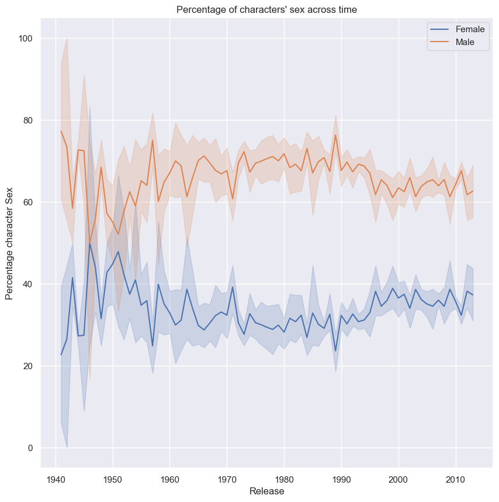
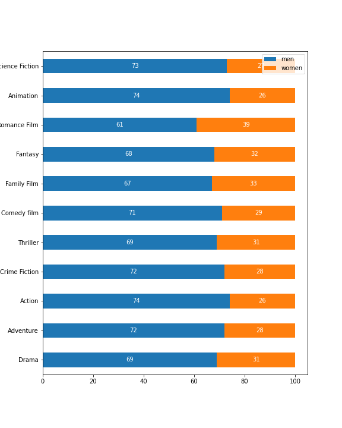
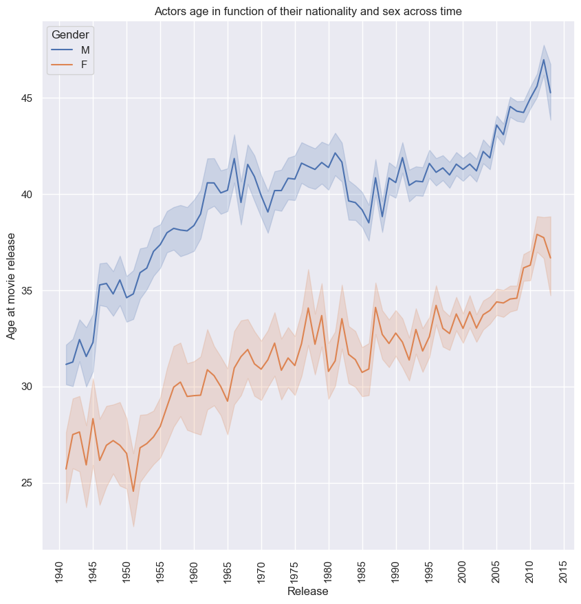
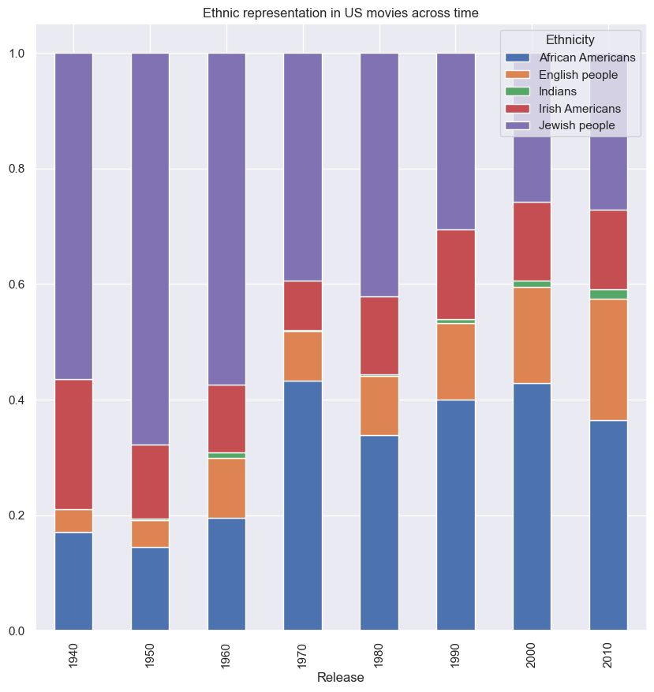
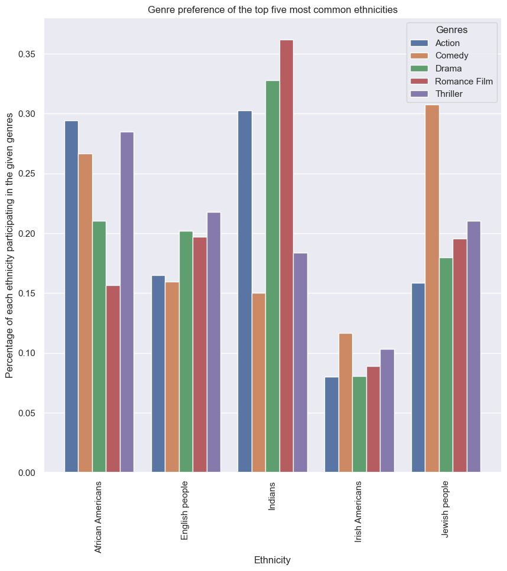

  

When you were little, watching the television, were you able to identify yourself with some characters? Did they inspire you to become the person you are today? 

It is important for children to see themselves represented in the media they consume, including movies. When children do not see themselves represented in movies, it can limit their perception of what is possible for them in the future. This lack of representation can also have negative effects on a child's self-esteem and self-concept([Chaplin and Roedder John, 2005](https://academic.oup.com/jcr/article/32/1/119/1796308?login=true#89509484)). Studies have shown that movies can influence a child's gender identity ([Aley and Hahn, 2020](https://link.springer.com/article/10.1007/s11199-020-01127-z)), moral foundation ([Gehman et al., 2021](https://journals.plos.org/plosone/article?id=10.1371/journal.pone.0248928)), ethnic identity ([Tukachinsky, 2015](https://spssi.onlinelibrary.wiley.com/doi/full/10.1111/josi.12104)), sexual identity ([Towbin et al., 2004](https://www.tandfonline.com/doi/abs/10.1300/J086v15n04_02)), and many other aspects of their self-representation. For example, a child who does not see characters that look like them or share their experiences may feel like they are not important or valued. On the other hand, seeing characters that they can relate to can help children feel seen and valued, and can also provide them with role models to look up to. In order for children to have a diverse range of options for their future selves, it is important for the movie industry to provide representation for all groups of people. Thus , we looked into which children groups are the most and least represented across the movie industry

 
### Girls vs boys 
  
In 2013, only 28.8% of main characters in US movies were female. This representation is slightly higher in European countries such as France and the UK and way higher in India. While the global population has a relatively [equal ratio](https://countrymeters.info/en/World) of males and females, this is not reflected in the movie industry. However, there has been a steady improvement in the representation of the two sexes in the movie industry since the 20th century, though perhaps not at a fast enough pace. This lack of representation can have negative effects on girls, who may not see themselves or their experiences reflected in the media they consume. It is important for the movie industry to continue working towards better representation for both sexes in order to create a more inclusive and accurate portrayal of society.
  
There is a noticeable variance in the gender ratio of film characters between the 1940s and 1960s. This may be due to the fact that the movie industry was just starting to take off at that time, and was also heavily influenced by major events such as World War II and the Cold War ([Yang et al., 2020](https://dl.acm.org/doi/10.1145/3411213)). After the 1960s, the gender ratio in film became more stable. It's also worth noting that while there has been some progress in terms of increased representation of female characters in film in recent decades, this progress has been slow and uneven.
 
 

  
 
 It is often thought that this poor representation of girls in movies is due to a belief that movies featuring female protagonists are not as financially successful as those featuring male protagonists. However, this is simply not true. A study by [Riley Pranian et Al.](https://digitalcommons.pace.edu/cgi/viewcontent.cgi?article=1351&context=honorscollege_theses) found that the gender ratio of a movie's cast has no impact on its revenue. This means that the movie industry has no excuse not to strive for better representation of both sexes in order to create a more inclusive and accurate portrayal of society.
  
However, the unequal sex ratio in movies was not the only issue with sex representation. Gender stereotypes were also prevalent. In particular, male protagonists were often seen in action, science finction and animation genres, while female protagonists were typically relegated to romantic and family genres. 

Research has shown that these stereotypes can have a negative impact on both men and women ([Ward and Aubrey, 2017](https://www.commonsensemedia.org/sites/default/files/research/report/2017_commonsense_watchinggender_fullreport_0620.pdf)). For example, the limited roles available to women in the movie industry can reinforce the belief that women are not as capable as men in certain areas, such as action and adventure. This can affect women's confidence and career aspirations in real life. At the same time, men who do not conform to traditional masculine stereotypes may feel pressure to conform to these narrow expectations in order to be successful in the movie industry.
  

  
  

- Sex representation in function of genres in function of time. N

We wanted to examine the age ranges of actors and actresses and found that there is a difference of 10 years between the two. More specifically, actors have a wider age range, with a mean around 40 years old. In contrast, the age range for actresses is smaller, with a mean around 30 years old. Both of these averages have risen in the past decade, but the age gap between actors and actresses remains evident and has existed since the beginning of the film industry.

This age gap can have significant consequences for the careers of actresses. For example, actresses may face ageism [(Raisborough et al., 2022)](https://www.tandfonline.com/doi/full/10.1080/08952841.2021.1910464) and discrimination in the industry, which can limit the roles available to them as they get older. This can make it difficult for them to sustain a successful acting career over the long term. Additionally, the limited age range for actresses may reinforce the belief that women are only valued for their youth and beauty, rather than for their talent and skill.
  

  
  
 In general, there is a lack of representation of women in film. When they do appear, they are often limited to stereotypical roles, such as the young romantic interest or family caregiver. Meanwhile, men are often depicted as heroic and brave in their mid 40s. These societal stereotypes are evident in the movie industry.
  
### Ethnicities 
Our study of ethnic representation in movies revealed that certain groups are underrepresented, similar to the situation with sex representation in the industry. This was a challenging analysis as it depends on the country of origin of the movies. As such, we conducted our analysis on a continental level. It is important to note that we are discussing ethnicity, not race. These two terms are often used interchangeably, but they refer to different things.

Race is a socially constructed category based on physical characteristics, such as skin color, facial features, and hair texture. These characteristics are used to assign individuals to a racial group, such as African, Asian, or Caucasian. Ethnicity, on the other hand, refers to a shared cultural heritage and identity. This can include factors such as language, religion, customs, and national origin. Ethnicity is often tied to race, but it is not determined solely by physical characteristics. 
  
It is crucial to differentiate between ethnicity and race because they are not the same thing. Race is often used to discriminate against individuals, while ethnicity is a matter of personal identity and cultural heritage. By recognizing the distinction between the two, we can avoid conflating them and better understand the diversity of human experience. 
 
  Our analysis revealed significant variations in ethnic representation in the film industry across different continents. It is therefore important to conduct a specific analysis of individual countries. In some regions, certain ethnic groups are significantly underrepresented, while in others, there is a more balanced representation. This lack of representation can have [negative effects](https://spssi.onlinelibrary.wiley.com/doi/full/10.1111/josi.12104) on members of underrepresented groups, who may not see themselves or their experiences reflected in the media they consume. 
  

  
  
  We examined the representation of ethnic groups in the US film industry, as the US is the leading producer of movies. We compared this representation to data on the ethnic makeup of the [US population](https://www.worldatlas.com/articles/largest-ethnic-groups-and-nationalities-in-the-united-states.html). Mexican Americans were found to be significantly underrepresented in film. In fact, they were not even among the top five ethnic groups represented in movies, despite being among the top three ethnicities in the US population.
  

  
  
  This analysis looked at the representation of different ethnicities in French film, as a way to examine ethnic representation in Europe through the lens of a country that is heavily involved in the movie industry. It's important to note that this analysis has some limitations. For example, the data on African Americans in French films is incorrect; this percentage would actually correspond to Algerian and Moroccan Berber people, based on [France's ethnic composition](https://www.britannica.com/place/France/People). Additionally, Moroccan and Algerian Arabs, who make up a significant portion of the French population, are underrepresented in French movies. Despite these limitations, the analysis does show an increase in the representation of various ethnicities in French film over the last few decades.
   
  We also examined the ethnic representation in India. However, we did not observe a significant increase in representation over time. It is important to note that this analysis has a significant limitation. In India, all individuals are generally considered as one ethnic group, despite the country being home to many different [ethnic groups](https://www.worldatlas.com/articles/biggest-ethnic-groups-in-india.html), such as Indo-Aryan, Dravidian, and Mongoloid. To gain a more accurate understanding of ethnic representation, it would be necessary to consider data from multiple sources. 
 
  #### Genres
In addition to examining the overall representation of different ethnicities in the movie industry, we also looked at the specific genres in which they were more likely to be represented. This analysis revealed that certain ethnicities are more heavily associated with certain genres, which can lead to stereotypes. Some of these stereotypes may be used for comedic effect, but they can also have negative consequences.

For example, certain ethnicities, such as Jews, may be more likely to be cast in comedic roles, or Indians may be more likely to be cast in romantic genres, which can reinforce the belief that they are inherently funny or attractive. This can create unrealistic expectations for members of these ethnicities and contribute to discrimination and prejudice. On the other hand, other ethnicities, such as African Americans, may be more likely to be cast in action or adventure genres, which can reinforce the belief that they are inherently strong or capable. This can put pressure on members of these ethnicities to conform to traditional masculine stereotypes in order to succeed in the film industry
  
  In the United States, it is not uncommon for African Americans to be cast in action movies and for Jewish actors to be cast in comedy films. This can perpetuate certain beliefs about the inherent characteristics of these ethnicities, such as the expectation that African Americans embody traditional masculine stereotypes and that Jewish people are inherently funny. Unfortunately, this also reinforces ethnic stereotypes, which can have an impact on the development of children and young people.
  
In films from the UK, we often see certain ethnicities cast in specific genres. For example, Jewish actors may be more likely to appear in comedy films and Irish actors in thrillers. This uneven distribution of ethnicities in different genres can contribute to the reinforcement of stereotypes. Additionally, English and British actors are frequently cast in period films, which makes sense given that the UK produces many historical films about its own history.
  
In India, it is common to see certain ethnicities featured in particular film genres. For instance, Malayali actors may be more likely to appear in drama films, while Bengali actors may be more prevalent in world cinema. Additionally, Punjabis are often well-represented in the popular Bollywood films. It is worth noting that there are limitations in analyzing ethnic data in Indian films.
  

  

### LGBT
Finally, we looked into the representation of LGBT individuals in the movie industry. Our analysis showed that only 1% of movies released in 2016 featured LGBT characters. This is a very small proportion and should be increased. However, there has been a steady increase in LGBT representation in the movie industry over the past century, which indicates that the industry is changing and becoming more inclusive.

Despite this progress, there is still a significant lack of representation for LGBT individuals in the movie industry. This can have negative effects on LGBT individuals, who may not see themselves or their experiences reflected in the media they consume. It can also contribute to the perpetuation of harmful stereotypes and discrimination against LGBT individuals.
  

  

Furthermore, [studies](https://www.tandfonline.com/doi/full/10.1080/00918369.2015.1021634?casa_token=s-4hvtU0OcYAAAAA%3AqJZurcrF5koASpzbOzAKZd3wUCatKx5Tmd_-JKdY3O3NEnoPgAGdp842QPXCXispzPLuapi-vxs38iA) have shown that a lack of LGBT representation can negatively impact the development of young children who may identify with this community. It can affect their self-esteem and self-image, and limit their understanding of the diversity of the world around them. This can contribute to the perpetuation of discrimination and prejudice.
  

### Conclusion  
  
Our analysis of the movie industry revealed significant disparities in the representation of different sexes, ethnicities, and LGBT individuals. While there has been some progress in recent years, these groups are still underrepresented in the industry compared to their proportions in the global population. This lack of representation can have negative effects on members of these groups, who may not see themselves or their experiences reflected in the media they consume. It can also contribute to the perpetuation of harmful stereotypes and discrimination.Furthermore, this lack of representation can have negative effects on the development of children who consume media. It can also limit their understanding of the diversity of the world around them and contribute to the perpetuation of discrimination and prejudice.

It is important for the movie industry to continue working towards better representation for all sexes, ethnicities, and LGBT individuals in order to create a more inclusive and accurate portrayal of society. This can help to promote equality and combat prejudice and discrimination. By striving for greater representation, the movie industry can play a role in promoting a more inclusive and diverse society, and in fostering the healthy development of children.
